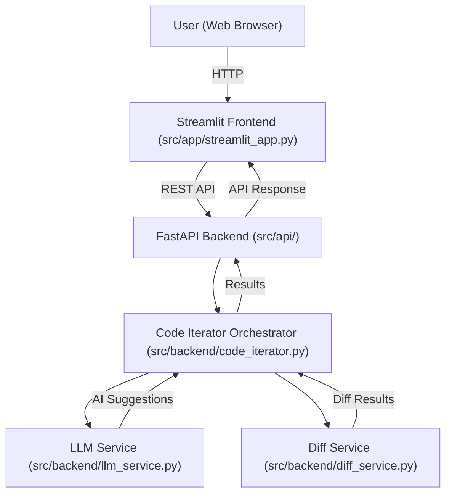

# Code Iterator AI

A modern, AI-powered tool for iterative code improvement, featuring a user-friendly web interface, advanced code suggestion capabilities, and visual diff analysis. Built with Streamlit, FastAPI, and Google Gemini LLM.

---

## Table of Contents

- [Features](#features)
- [Project Structure](#project-structure)
- [Architecture](#architecture)
- [Getting Started](#getting-started)
- [Configuration](#configuration)
- [Usage](#usage)
- [API Reference](#api-reference)
- [Tech Stack](#tech-stack)
- [Contributing](#contributing)
- [License](#license)

---

## Features

- **AI-Powered Code Suggestions:** Leverages Google Gemini 2.5 Flash for intelligent, context-aware code improvements.
- **Universal Language Support:** Works with any programming language.
- **Visual Diff Analysis:** Instantly see what changed, with line-by-line metrics.
- **In-Place Code Integration:** Seamlessly update your code with a single click.
- **Iterative Workflow:** Undo/redo and prompt for further improvements.
- **Modern UI:** Clean, dark-themed interface with syntax highlighting and responsive design.

---

## Project Structure

```
.
├── main.py                # Entry point: launches both backend and frontend
├── requirements.txt       # Python dependencies
├── .gitignore             # Files and folders to ignore in git
├── src/
│   ├── app/
│   │   └── streamlit_app.py   # Streamlit frontend application
│   ├── api/
│   │   ├── fastapi_app.py     # FastAPI app instance
│   │   ├── models.py          # Pydantic models for API
│   │   └── routes.py          # API endpoints
│   ├── backend/
│   │   ├── code_iterator.py   # Orchestrates LLM and diff workflow
│   │   ├── diff_service.py    # Diff generation and summary
│   │   └── llm_service.py     # LLM (Google Gemini) integration
│   └── utils/
│       ├── config.py          # Loads environment variables
│       └── logger.py          # Logging setup
└── venv/                  # (Ignored) Python virtual environment
```

---

## Architecture



- **Frontend:** Streamlit app for user interaction, code editing, and result visualization.
- **Backend:** FastAPI server exposing endpoints for code improvement and health checks.
- **Orchestrator:** Manages the workflow: receives code & prompt, calls LLM, generates diff, returns results.
- **LLM Service:** Interfaces with Google Gemini via LangChain for code suggestions and explanations.
- **Diff Service:** Computes and summarizes code changes using Python’s `difflib`.

---

## Getting Started

### 1. **Clone the Repository**
```bash
git clone https://github.com/Tarun304/Code-Iterator-AI.git
cd Code-Iterator-AI
```

### 2. **Set Up a Virtual Environment**
```bash
python -m venv venv
source venv/bin/activate  # On Windows: venv\Scripts\activate
```

### 3. **Install Dependencies**
```bash
pip install -r requirements.txt
```

### 4. **Configure Environment Variables**
Create a `.env` file in the project root:
```
GOOGLE_API_KEY=your_google_api_key
LANGSMITH_API_KEY=your_langsmith_api_key
LANGSMITH_TRACING= true
LANGSMITH_PROJECT= "Code Iterator AI"

```

### 5. **Run the Application**
```bash
python main.py
```
- This will start both the FastAPI backend and the Streamlit frontend.

---

## Configuration

- **Environment Variables:** Managed via `.env` and loaded with `python-dotenv` (see `src/utils/config.py`).
- **Logging:** Uses `loguru` for rich, colorized logs (see `src/utils/logger.py`).

---

## Usage

1. **Open your browser** and go to `http://localhost:8501`.
2. **Paste or write your code** in the editor.
3. **Describe your improvement goals** in the prompt area.
4. **Click "Get AI Code Suggestion"** to receive improved code, a diff, and an explanation.
5. **Integrate changes** or undo as needed.

---

## API Reference

### **POST `/api/suggest-code`**

- **Request Body:**
  ```json
  {
    "original_code": "string",
    "user_prompt": "string"
  }
  ```
- **Response:**
  ```json
  {
    "original_code": "string",
    "improved_code": "string",
    "explanation": "string",
    "diff": { /* diff summary */ },
    "success": true
  }
  ```

### **GET `/api/health`**
- Returns API health status.

---

## Tech Stack

- **Frontend:**
  - Streamlit
  - streamlit-ace (code editor)

- **Backend:**
  - FastAPI
  - Uvicorn
  - httpx

- **AI/LLM & Orchestration:**
  - Google Gemini 2.5 Flash (via google-generativeai)
  - LangChain
  - LangChain Google GenAI
  - LangGraph (workflow orchestration)

- **Diff & Utilities:**
  - Python `difflib` (via custom service)
  - udiff
  - Pydantic (data validation)
  - python-dotenv (environment management)
  - Loguru (logging)

- **Other:**
  - All dependencies listed in `requirements.txt`

---

## Contributing

1. Fork the repository.
2. Create a new branch (`git checkout -b feature/your-feature`).
3. Commit your changes (`git commit -am 'Add new feature'`).
4. Push to the branch (`git push origin feature/your-feature`).
5. Open a pull request.

---

## License

[MIT License](LICENSE)

---

**For questions or support, please open an issue or contact the maintainer.**
